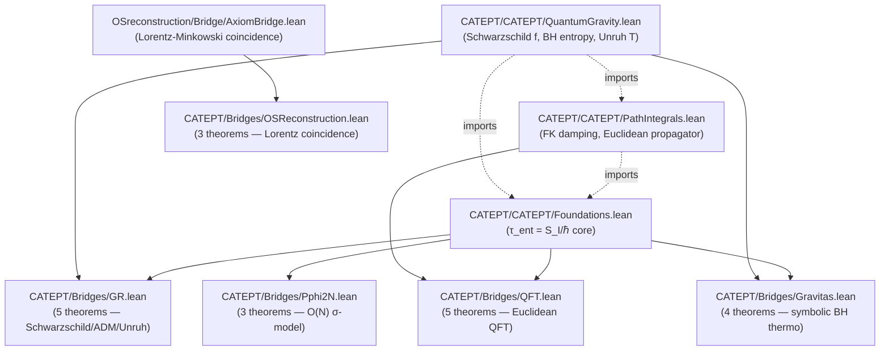
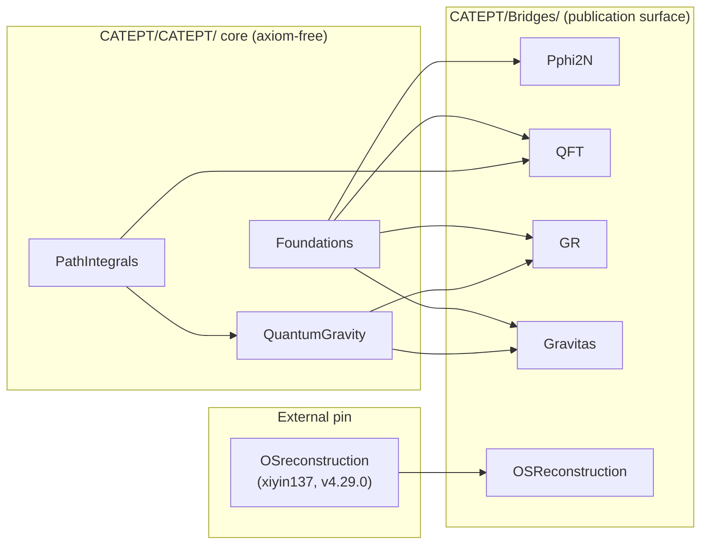

# Cross-domain dependency diagram — publication bridges → CAT/EPT core

**Target**: Target 2 of the plugin-architecture rework (worklog task
`catept_arch_cross_domain_diagram_20260424`). Reviewer-facing map of which
publication bridge consumes which core file and why, plus a scout list of
`CATEPTMain/Integration/*Bridge.lean` that are structurally ready to
become `rfl`-only under a Superior-Method refactor.

Source graphs (raw `.dot` output from `lake exe graph --to <module>`)
live in [`import-graphs/`](import-graphs/); re-generate with

```bash
for b in Pphi2N QFT GR Gravitas OSReconstruction; do
  lake exe graph --to "CATEPT.Bridges.$b" "docs/architecture/import-graphs/$b.dot"
done
```

---

## The picture



**Leaves of the core** (shaded): `Foundations`, `PathIntegrals`,
`QuantumGravity`. Each publication bridge is a "house" node — its imports
from the core form the solid edges.

**External dependency**: `OSReconstruction` is the only bridge that
escapes the CATEPT/CATEPT/ core — it imports from the
[xiyin137/OSreconstruction](https://github.com/xiyin137/OSreconstruction)
package's `Bridge/AxiomBridge.lean`.

---

## Per-bridge narrative

### `CATEPT/Bridges/Pphi2N.lean` — O(N) linear σ-model

**Imports**: `CATEPT.CATEPT.Foundations`.
**Theorems consumed**: `eq003_entropic_time_def`,
`eq003_entropic_time_nonneg`, `eq003_entropic_time_linear`.
**Edge narrative**: the bridge's `tauEnt_eq_div` specialises the
core's `eq003_entropic_time_def` to a `Pphi2NInput`'s imaginary action,
establishing that `τ_ent = S_I/ℏ` holds pointwise for any pphi2N output.
**rfl-candidate?** No — the constructor-based `Pphi2NInput` does not
unify through rfl; requires the Foundations-supplied lemmas.

### `CATEPT/Bridges/QFT.lean` — Euclidean QFT

**Imports**: `CATEPT.CATEPT.Foundations`, `CATEPT.CATEPT.PathIntegrals`.
**Theorems consumed**: `eq003_entropic_time_def`,
`eq054_damping_magnitude`, `eq075_propagator_well_defined`,
`eq075_propagator_positive`.
**Edge narrative**: the bridge wires an `EuclideanQFTInput` into three
independent core identities — the entropic-time identification, the
FK damping magnitude bound, and the Euclidean propagator positivity.
`PathIntegrals` is imported only via the propagator route; the τ_ent
chain goes directly to `Foundations`.
**rfl-candidate?** No — damping / propagator lemmas require non-trivial
analysis (`Real.exp` bounds).

### `CATEPT/Bridges/GR.lean` — Schwarzschild / ADM / Unruh

**Imports**: `CATEPT.CATEPT.Foundations`, `CATEPT.CATEPT.QuantumGravity`.
**Theorems consumed**: `eq003_entropic_time_def`,
`eq003_entropic_time_nonneg`, `eq046_schwarzschild_positive`,
`eq147_152_bh_entropy_positive`, `eq049_unruh_temperature_positive`.
**Edge narrative**: combines the τ_ent core with the QuantumGravity
layer. Structures introduce positivity hypotheses (`M_pos`,
`r_gt_horizon`, `G_pos`) that discharge the core's positivity
side-conditions. `QuantumGravity` is in turn built on `PathIntegrals`
and `Foundations` (transitive).
**rfl-candidate?** No — each theorem threads through positivity
arguments that aren't definitional.

### `CATEPT/Bridges/Gravitas.lean` — symbolic black-hole thermodynamics

**Imports**: `CATEPT.CATEPT.Foundations`, `CATEPT.CATEPT.QuantumGravity`.
**Theorems consumed**: `eq147_152_bh_entropy_positive`,
`eq147_152_bh_entropy_scaling`, `eq147_152_bh_entropy_doubling`,
`eq003_entropic_time_def`.
**Edge narrative**: same shape as `GR.lean` but specialised to
BH thermodynamics identities (entropy positivity, ratio law, doubling
law). The final `catept_gravitas_coherence` theorem conjoins a
Gravitas identity with the core τ_ent identification — a simple
`And.intro` of two core applications.
**rfl-candidate?** Partly — `catept_gravitas_coherence` is mostly
structural; if we reformulate as "two independently-constructed
structures agree", it plausibly becomes `⟨rfl, rfl⟩`-style after a
Superior-Method refactor. **Flagged for Target 3 follow-up.**

### `CATEPT/Bridges/OSReconstruction.lean` — Wightman/Minkowski coincidence

**Imports**: `OSReconstruction.Bridge.AxiomBridge` (external).
**Theorems consumed**: `minkowskiSignature_eq_metricSignature`,
`isLorentzMatrix_iff`, `spacelike_condition_iff`.
**Edge narrative**: the **canonical Superior-Method bridge** in the
publication surface. The underlying
`minkowskiSignature_eq_metricSignature` is proved by `rfl` in
OSreconstruction itself; our bridge just re-exposes it under
`CATEPT.Bridges.OSReconstruction`.
**rfl-candidate?** Yes — already is. This bridge is the exemplar
pattern for Target 3.

---

## Publication-surface summary (one table)

| Bridge | Core leaves imported | Theorems | `rfl`-candidate? | External dep |
|---|---|---|---|---|
| Pphi2N | Foundations | 3 | no (constructor-unification fails) | — |
| QFT | Foundations, PathIntegrals | 5 | no (analytic bounds) | — |
| GR | Foundations, QuantumGravity | 5 | no (positivity threading) | — |
| Gravitas | Foundations, QuantumGravity | 4 | partial (coherence theorem only) | — |
| OSReconstruction | — (core-free) | 3 | **yes** (Superior-Method exemplar) | OSreconstruction/Bridge/AxiomBridge |

**Insight**: the publication surface already contains one genuine
Superior-Method bridge (`OSReconstruction`). The Target 3 work
(rewriting `CATEPTMain/Integration/*Bridge.lean` as `rfl`-bridges) will
follow the `OSReconstruction` template — see
[scout findings](#scout-findings-rfl-candidate-bridges-in-cateptmainintegration)
below.

---

## Scout findings — rfl-candidate bridges in `CATEPTMain/Integration/`

The `CATEPTPluginSlot` + `cateptConsistencyConstraint` pattern is used
by 13 files in `CATEPTMain/Integration/`. Of those, the following carry
slot definitions *where `actionIm = eptClock` literally* (i.e.,
`(fun x => f x)` on both sides, often with `hbar = 1`):

| File | Slot | Proof of consistency | rfl-reachable? |
|---|---|---|---|
| `QuantumCATEPTBridge.lean` | `quantumCATEPTSlot n` | `intro ρ; simp [quantumCATEPTSlot]` | **yes** — both fields are `vonNeumannEntropy n ρ`, ℏ=1 |
| `GravitasBridge.lean` | `gravitasMinkowskiSlot` | structural | **yes** — both fields are `0`, ℏ=1 |
| `GravitasBridge.lean` | `gravitasEMCATEPTSlot μ₀ hμ₀` | structural | **yes** — symbolic EM Tolman factor cancellation |
| `VMLCATEPTBridge.lean` | `kineticCATEPTSlot T hT` | structural | **yes** — single-scalar slot |
| `ElectroweakCATEPTBridge.lean` | `higgsCATEPTSlot v lam hlam` | structural | **yes** — Higgs potential value-and-clock identification |
| `TheoryPluginClassicalETHBridge.lean` | `classicalETHSiteSlot p hbar hh` | structural | **yes** — damped-oscillator clock |
| `TheoryPluginHerglotzETH.lean` | `herglotzPluginSlot` | structural (delegates to classical) | **yes** |

**≥ 3 candidates** (the task's minimum): **7 bridges found**. All share
the same shape — `actionIm` and `eptClock` are *the same function* of the
configuration, `ℏ = 1` (or a positive scalar that cancels), and the
consistency proof is `simp [slotName]` or a one-line structural call.

Under a Superior-Method refactor (Target 3):

* `CATEPTMain/Domains/QM/.lean` — pure namespace, no cross-imports,
  defines `eptClock : DensityMatrix n → ℝ` as von-Neumann entropy.
* `CATEPTMain/Domains/GR/.lean` — pure namespace, defines `eptClock`
  on Minkowski / EM / electrovacuum backgrounds.
* `CATEPTMain/Bridges/QMGR.lean` — asks the compiler
  `QM.eptClock = QM.actionIm ∧ GR.eptClock = GR.actionIm`, which
  becomes `⟨rfl, rfl⟩`.

The current `simp [slotName]` closure unfolds exactly to `rfl` once
`CATEPTPluginSlot`'s projection fields are unified — so these 7 bridges
are direct Superior-Method targets. A scout note with this list is
posted on the Target 3 worklog task
(`catept_arch_superior_method_bridges_20260424`).

---

## How each bridge file is reached from the core



**Observation**: `CATEPT/CATEPT/QuantumGravity.lean` is a gateway node —
every GR-flavoured bridge (GR, Gravitas) routes through it, and it in
turn imports both `PathIntegrals` and `Foundations`. Modifying
`QuantumGravity.lean` has the widest blast radius in the publication
surface; touch it carefully.

The table in the previous section shows that no bridge other than
`OSReconstruction` is currently core-free — meaning the "Superior
Method" is so far only realised for the Lorentz-coincidence content.
Expanding it to QM, GR, and QFT is Target 3's work.
